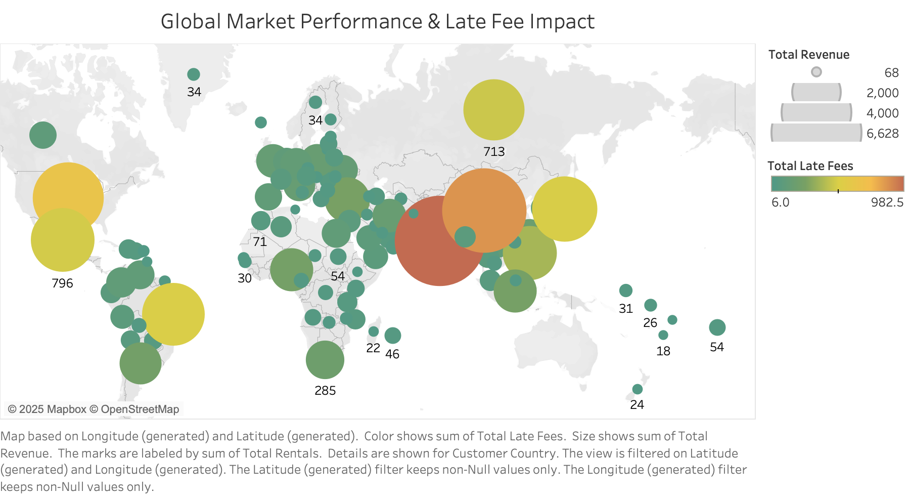

# CIS467 — Data Management, Data Warehousing & Data Visualization

**Simon Business School** | Spring 2025

A comprehensive course portfolio covering relational database design, MySQL querying, data warehousing concepts, and business intelligence dashboards built in Tableau — applied to real-world datasets including the **Sakila DVD Rental** database.

---

## Overview

This repository documents hands-on work from CIS467, progressing from foundational database design through advanced SQL analysis and culminating in interactive Tableau dashboards. The project analyzes film rental performance, customer behavior, and revenue patterns to surface actionable business insights.

**Datasets Used:**
- **Sakila** — DVD rental store (films, customers, payments, inventory)
- **Accounts Payable (AP)** — vendor invoices and payment tracking
- **Expense** — employee travel and reimbursement records
- **University** — courses, professors, and enrollment sections

---

## Database Design & Schema

### ER Diagram — Accounts Payable Database
The HW1 MySQL Workbench model (`HW1-PrahladNarayanBhardwaj.mwb`) maps vendor relationships, invoice cycles, and payment terms across normalized tables.

**Key design principles applied:**
- 1NF → 3NF normalization to eliminate redundancy
- Foreign key constraints enforcing referential integrity
- Junction tables for many-to-many relationships

---

## SQL Analysis

### Core Questions Explored

1. Which vendors have outstanding invoices within a given date range?
2. How do total expenses break down by employee across multiple trips?
3. Which departments have employees — and which do not? (LEFT/RIGHT JOIN analysis)
4. How do course prerequisites form self-referencing relationships?
5. What are the top-ranked Billboard songs for a given week?
6. How can UNION combine active and paid invoice records into a single report?

### Key SQL Techniques

```sql
-- Expense analysis: total spend per employee with trip count
SELECT e.ssn, e.first_name, e.last_name,
       SUM(gross_amount) AS total_expense,
       COUNT(DISTINCT t.trip_id) AS number_of_trips
FROM employees e
JOIN trips t ON e.ssn = t.employee
JOIN expenses ex ON t.employee = ex.employee AND t.trip_id = ex.trip_id
GROUP BY e.ssn, e.first_name, e.last_name
ORDER BY total_expense DESC;
```

```sql
-- UNION: combine active and paid invoices
SELECT 'Active' AS source, invoice_number, invoice_date, invoice_total
FROM active_invoices WHERE invoice_date >= '2018-06-01'
UNION
SELECT 'Paid' AS source, invoice_number, invoice_date, invoice_total
FROM paid_invoices WHERE invoice_date >= '2018-06-01'
ORDER BY invoice_total DESC;
```

```sql
-- Self-join: course prerequisites
SELECT c.courseID, c.courseTitle, pre.courseTitle AS prerequisite
FROM courses c
JOIN courses pre ON c.prereqCourse = pre.courseID
WHERE c.prereqCourse != '';
```

---

## Visual Insights (Tableau)

All visualizations were built on the Sakila database using Tableau, analyzing rental activity, customer value, and revenue distribution.

* * *

### Project Dashboard


The main project dashboard consolidates customer segmentation, revenue distribution, and rental activity into a single executive view.

* * *

### Dashboard Overview




High-level overview panels tracking store performance metrics and rental trends across the 2005–2006 period.

* * *

### Genre Distribution by Total Revenue


Breaks down total revenue by film genre, identifying which categories generate the highest returns for inventory planning.

* * *

### Global Market Performance & Late Fee Impact


Analyzes how late fees contribute to overall revenue and their distribution across customer segments globally.

* * *

### Customer Base Composition — VIP to At-Risk Segments


Segments the customer base from high-value VIP renters down to at-risk customers showing declining activity — enabling targeted retention strategies.

* * *

### Customer Frequency-Value Matrix


An RFM-style matrix plotting rental frequency against spend value to identify growth opportunities and upsell candidates.

* * *

### Genre Revenue Distribution — Average Revenue by Film Category


Compares average revenue per rental across film categories, revealing which genres command higher price points relative to volume.

* * *

### Hourly Rental Activity Distribution


Maps rental transactions by hour of day, showing peak demand windows to inform staffing and promotional scheduling.

* * *

### Monthly Rental Distribution by Store (2005–2006)


Side-by-side monthly rental volume for Store 1 vs Store 2, highlighting seasonal patterns and inter-store performance gaps.

* * *

### Predictive Demand Analysis


Forecasts rental demand using historical trends to support inventory and acquisition decisions.

---

## Key Insights

- **Sports and Action genres** drive the highest total revenue, while **Travel and Music** genres average higher revenue per rental
- **Peak rental hours** cluster in the evening (6–9 PM), suggesting targeted promotions during off-peak afternoon hours
- **Store 2 consistently outperforms Store 1** in monthly volume, particularly during summer months in 2005
- **A small VIP segment** (~15% of customers) accounts for a disproportionate share of revenue — retention of this group is critical
- **Late fees contribute meaningfully** to total revenue, indicating an opportunity to model fee structures for revenue optimization

---

## Project Files

| Folder / File | Description |
|---|---|
| `HW1-PrahladNarayanBhardwaj.mwb` | MySQL Workbench ER diagram — Accounts Payable schema |
| `create_db_ap(1).sql` | DDL script: Accounts Payable database |
| `create_expense.sql` | DDL script: Employee expense tracking database |
| `expense_queries_to_start_HW3.sql` | HW3 analytical queries — expense aggregation and JOINs |
| `week_3_exercises_part1.sql` | Week 3 exercises — JOINs, UNIONs, subqueries |
| `Week 1 Part 1&2/` | Week 1 labs — foundational SELECT, filtering, ordering |
| `Week 1 Part 1&2/Part 2/` | University DB scripts — schema creation and seed data |
| `Final Tableau/` | Final project Tableau dashboard screenshots |
| `Simon Syllabus Jan6_2025_CIS467_A3_v1.pdf` | Course syllabus |
| `Week 1 Part 1&2/1_3_DatabaseDesign_DataNormalization_cis467.pdf` | Lecture notes: normalization theory |

---

## Conclusion

This course portfolio demonstrates an end-to-end data pipeline workflow — from schema design and normalization through SQL querying and aggregation to business intelligence visualization in Tableau. The Sakila dataset provided a realistic, multi-table environment for applying warehouse-style analysis, while the AP and expense databases grounded SQL fundamentals in enterprise use cases. The resulting dashboards translate raw rental data into strategic insights around customer value, inventory demand, and revenue optimization.
